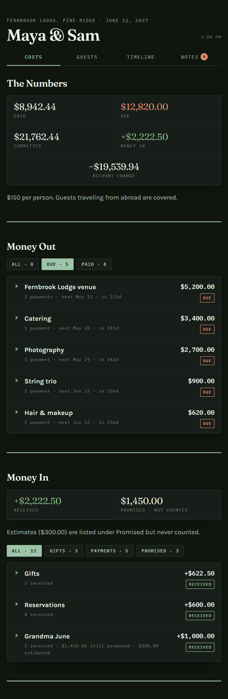
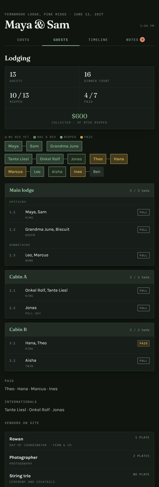
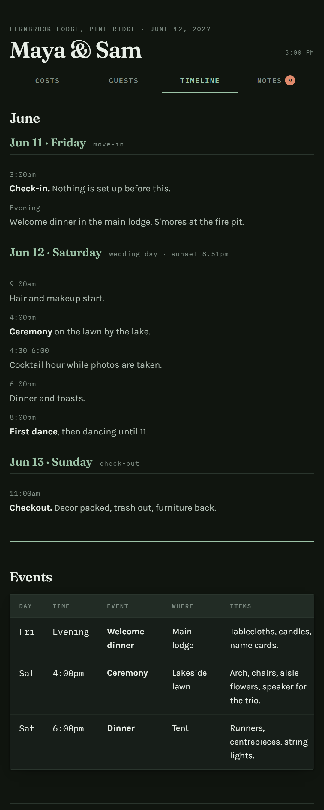
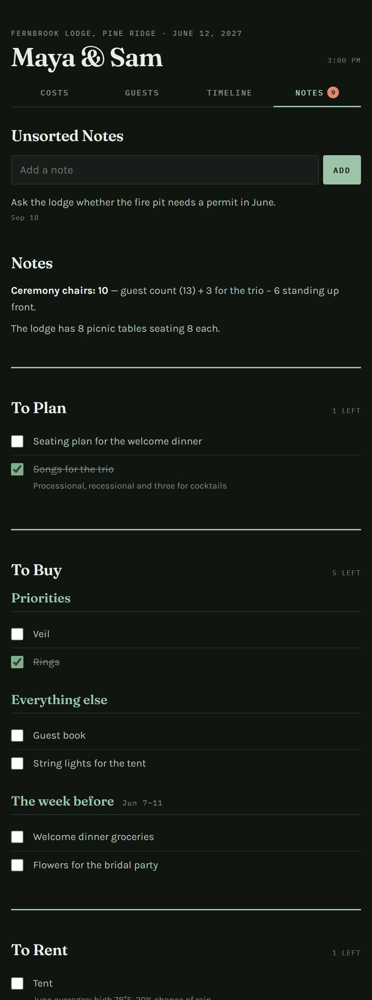

# Wedding Tracker

**Every cost, gift, guest and bed of a wedding, on one private page that lives
on your phone.**

**[Open the live demo →](https://aj-protzel.github.io/wedding-tracker/)** —
a made-up wedding, nothing to sign in to.

| Costs | Guests | Timeline | Notes |
|:---:|:---:|:---:|:---:|
|  |  |  |  |

Built for a real 30-guest lodge wedding, where the couple, both families and
the vendors all needed the same numbers at the same time, and a spreadsheet
kept falling out of date.

## What it does

### Costs
- **The Numbers.** Paid, still due, committed, money in, and what the whole
  wedding does to your account, at a glance.
- **Money Out.** One row per vendor that opens to its payments and instalments
  (1/2, 2/2). "Due in 12 days" and "overdue" are worked out from the dates, and
  a refundable deposit is listed but kept out of every total.
- **Money In.** Gifts, guest contributions and family money in one place. A
  gift in another currency shows its own amount beside its home-currency value.
- **Family Tab.** What a parent or grandparent has promised against what they
  have actually given. A promise to "cover hair and makeup" reads its figure
  straight from those vendors' costs, so nothing is typed twice.

### Guests
- **Name boxes that fill in as things get settled:** grey, then a bed, then an
  RSVP, then paid in gold. Couples and families are tied together.
- **Lodging as cabin cards,** bed by bed, each reading free, full or paid.
- **The counts that matter:** guests, dinner plates (vendors who eat
  included), RSVPs, who has paid and how much has been collected.

### Timeline and Notes
- **The weekend hour by hour,** and an events table of what goes where.
- **Numbers that keep themselves current.** "Ceremony chairs: 28" is worked
  out from the guest list, never typed.
- **Checklists either of you can tick from your phone,** and a box for dropping
  in a note to sort later.

### Everywhere
- **Made for phones.** Add it to the home screen and it opens like an app,
  signed in, with fresh numbers every time it comes to the front.
- **Light and dark,** following the phone.
- **Private.** Only the logins you create can open it.

## How it works

One HTML file, no build step, no framework. It signs in to your own
[Supabase](https://supabase.com) project and makes a single call that returns
everything the page draws. Every table is locked; the page can only read, tick
a checklist item or add a note. Hosting is any static host — GitHub Pages and
Cloudflare Pages both work free.

```
index.html      the whole app
schema.sql      the whole database, run once
demo-data.json  the made-up wedding the demo shows
```

## Set it up

1. Create a free Supabase project and run `schema.sql` in its SQL editor.
2. Under Authentication, turn sign-ups off and add a login for each of you,
   ticking Auto Confirm.
3. In `index.html`, set `SUPABASE_URL` and `SUPABASE_KEY` (Project Settings →
   API → the publishable key), and `HOME_CURRENCY` if not dollars.
4. Put the folder on a static host. On a phone, open it, Share → Add to Home
   Screen, and sign in inside the new icon.

Then fill in `settings` with your names, venue and date, and add vendors,
guests, beds and costs in Supabase's table editor — or ask an AI assistant
with the Supabase connector to do it for you. Links can open a tab directly:
`#guests`, `#timeline`, `#notes`.

## Get your own

This is a showcase of work, not a free template. If you would like a tracker
for your own wedding — set up for you, or licensed to run yourself — get in
touch through [GitHub](https://github.com/AJ-Protzel).

## License

All rights reserved. The code is published to show the work; it may not be
copied, modified, hosted or sold without written permission. See `LICENSE`.
